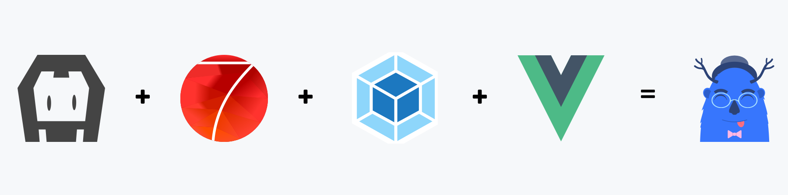

<!--
#
# Licensed to the Apache Software Foundation (ASF) under one
# or more contributor license agreements.  See the NOTICE file
# distributed with this work for additional information
# regarding copyright ownership.  The ASF licenses this file
# to you under the Apache License, Version 2.0 (the
# "License"); you may not use this file except in compliance
# with the License.  You may obtain a copy of the License at
#
# http://www.apache.org/licenses/LICENSE-2.0
#
# Unless required by applicable law or agreed to in writing,
# software distributed under the License is distributed on an
# "AS IS" BASIS, WITHOUT WARRANTIES OR CONDITIONS OF ANY
#  KIND, either express or implied.  See the License for the
# specific language governing permissions and limitations
# under the License.
#
-->



# Framework7 - Vue - Webpack Cordova Template
You can start your new cordova project perfectly with this template.

This template uses:
* [Framework7 4](https://framework7.io)
* [Vuejs 2](https://vuejs.org/)
* [Vuex](https://github.com/vuejs/vuex)
* [Webpack 4](https://webpack.github.io/)
* [Cordova](https://cordova.apache.org/)
* [FontAwesome](http://fontawesome.io/)
* [Babel Loader 7](https://github.com/babel/babel-loader)


## Minimum Requirements
* **Cordova:** _6.0.0_
* **Node.js:** _6.5.0_ (Supports ES6)

## WARNING (For Linux and Mac OS users):

For live-reload i can't find easy way to do fixed version of this. But you can develop your app with this way:

1. `cordova platform add ios browser` (browser needs for development in live-reload mode.)
2. `cordova run ios -- --lr` (wait till app opens in your ios emulator or phone. it will close console output after publish, so live-reload will not work. don't close the app and go to next step.)
3. `cordova run browser -- --lr` (you can use live-reload in your phone-emulator and browser at same time. you can edit your files in live-reload mode now.)

---

## Features

Hooks are smart. They can fix some problems for you. Fix list:
* `npm install` Automatically checks node js dependencies.
* `package.json` Renames `name` variable if it has a space characters and auto saves. (It needed for npm install)
* `www` Automatically manages `www` folder. You don't need to think about www folder. Your target is always `src` folder.
* `static` Static assets automatically sync on live reload!
* `CordovaHtmlOutputPlugin` Automatically adds `cordova.js` to html. You don't need to add to your file manually. It's helpful for webpack.
* `manifest.json` Some cordova plugins needs manifest.json in root folder. If you add manifest.json file to your `src` folder, our smart hooks automagically copy it to `www` folder!

###### Live Reload Related
* `config.xml` Live reload needs `<allow-navigation href="*"/>` in development mode. So our smart hooks manages this too. You don't need to think about it.
* `live-reload` Manages live-reload dependencies automatically. Just write your code, and don't think about dependencies.
* `device_router.html` Smart router in live-reload mode. It searches for best available ip for connect server. if it can't find, you can write ip:port manually.
* `CordovaDeviceRouter.js` In live-reload mode, you can connect to server from multiple devices. This file inject right `cordova.js` file to page. So you can connect to webpack-dev-server from multiple devices at same time.

## Installation
### IMPORTANT: Phonegap build tools not supported currently. I suggest to use cordova with this template.

This template need cordova or phonegap, for more information [cordova installation](https://cordova.apache.org/docs/en/latest/guide/cli/) or [phonegap installation](http://docs.phonegap.com/getting-started/1-install-phonegap/desktop/).

Our Magic words:

``` bash
cordova create <project_create_dir> [com.example.projectname] [ProjectClassName] --template cordova-template-framework7-vue-webpack
phonegap create <project_create_dir> [com.example.projectname] [ProjectClassName] --template cordova-template-framework7-vue-webpack
```

boom! :boom: you have your brand new cordova / phonegap project with framework7 - vue 2 and webpack 4!


## Installation using pre-defined templates

Framework v4 version

``` bash
cordova create cordova-template com.template DefaultTemplate --template git://github.com/caiobiodere/cordova-template-framework7-vue-webpack.git#master
```

[Framework Single View v4 version](https://github.com/framework7io/framework7-template-single-view)

``` bash
Still working
```

[Framework Tabbed Views v4 version](https://github.com/framework7io/framework7-template-tabs)

``` bash
Still working
```

[Framework Split View v4 version](https://github.com/framework7io/framework7-template-split-view)

``` bash
Still working
```

Framework v3 version

``` bash
cordova create cordova-template com.template DefaultTemplate --template git://github.com/caiobiodere/cordova-template-framework7-vue-webpack.git#feature/v3-default-template
```

---

## Usage

You can use every cordova | phonegap commands.
You just have one more command option: `-- --lr`. It starts live reload.

Example usage:
```
cordova run android -- --lr
cordova run browser -- --live-reload
phonegap run ios -- --lr
```

And :tada: that's all folks!

---

## Using Cordova-Simulate from microsoft

We can use Microsoft Cordova-Simulate using:
* [Cordova-Simulate Plugin](https://marketplace.visualstudio.com/items?itemName=vsmobile.cordova-tools)

You can check:
* [hookers.js](template_src/hooks/hookers.js),
* [beforedep.js](template_src/hooks/beforedep.js),
* [CordovaDeviceRouter.js](template_src/webpack/dev_helpers/CordovaDeviceRouter.js),
* [device_router.html](template_src/webpack/dev_helpers/device_router.html)

for more information.
